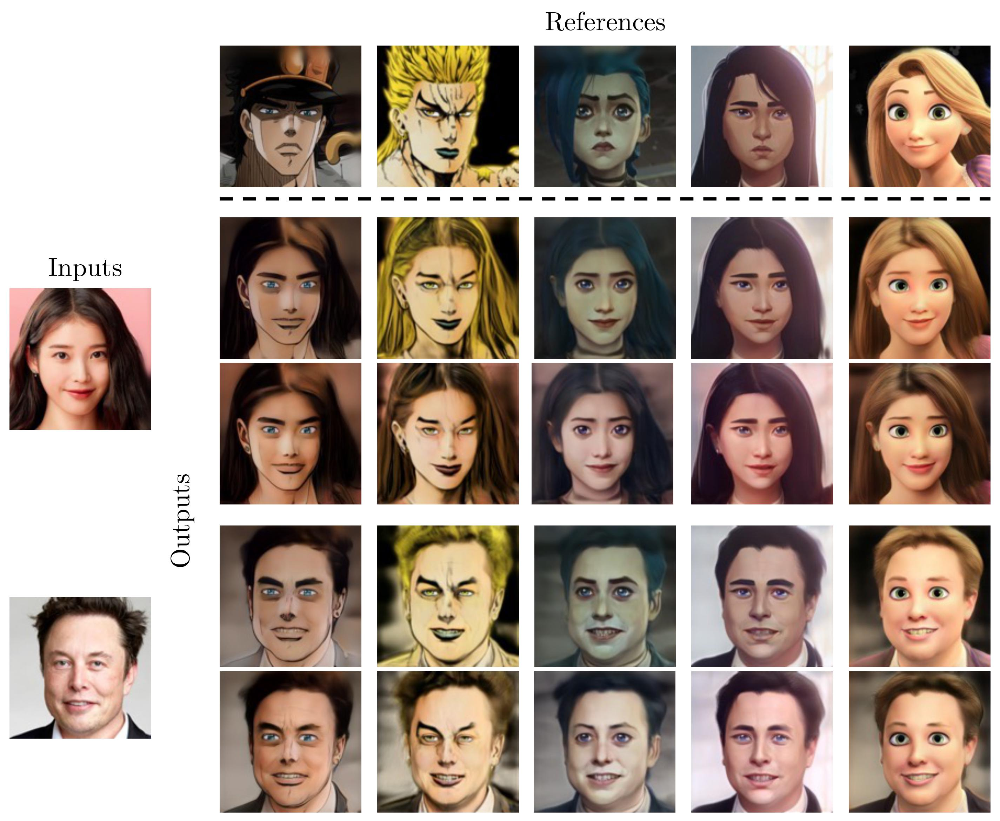

# JoJoGAN: One Shot Face Stylization


This is the PyTorch implementation of [JoJoGAN: One Shot Face Stylization](). [](https://colab.research.google.com/github/mchong6/JoJoGAN/blob/main/stylize.ipynb)


>**Abstract:**<br>
While there have been recent advances in few-shot image stylization, these methods fail to capture stylistic details
that are obvious to humans. Details such as the shape of the eyes, the boldness of the lines, are especially difficult
for a model to learn, especially so under a limited data setting. In this work, we aim to perform one-shot image stylization that gets the details right. Given
a reference style image, we approximate paired real data using GAN inversion and finetune a pretrained StyleGAN using
that approximate paired data. We then encourage the StyleGAN to generalize so that the learned style can be applied
to all other images.


## How to use
Everything to get started is in the [colab notebook](https://colab.research.google.com/github/mchong6/JoJoGAN/blob/main/stylize.ipynb).

## Citation
If you use this code or ideas from our paper, please cite our paper:
```
```

## Acknowledgments
This code borrows from [StyleGAN2 by rosalinity](https://github.com/rosinality/stylegan2-pytorch), [e4e](https://github.com/omertov/encoder4editing) and [ReStyle](https://github.com/yuval-alaluf/restyle-encoder).
